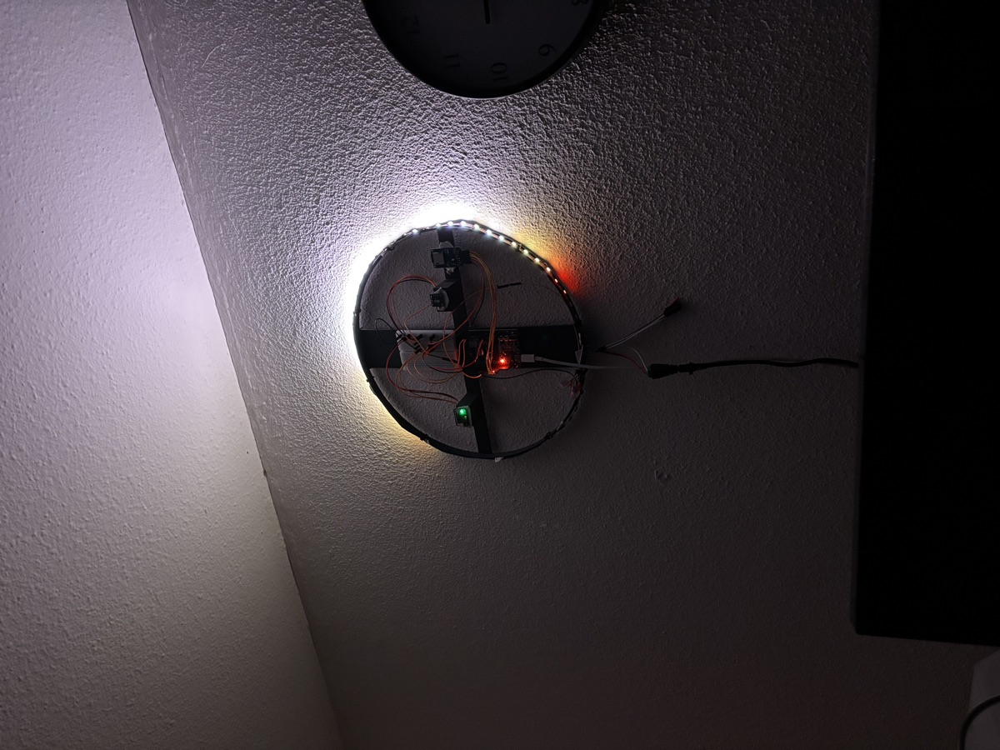
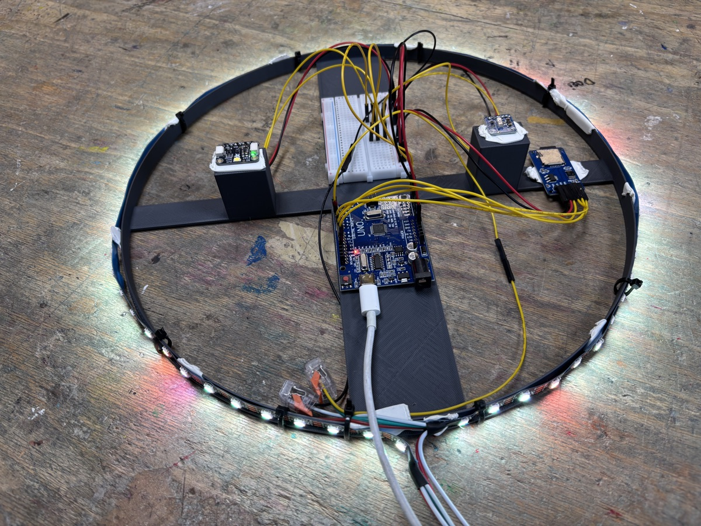

# Carpe Lucem

 

I was looking for a way to capture a day in light. This is a ring of LEDs
showing the light of the past day — each new measurement enters at the front and
pushes the rest along, so the whole day is there at once, bright to dim, cool to
warm.

## Hardware

- Arduino with I2C and SPI (Uno, Nano, ...)
- VEML7700 lux sensor — I2C
- AS7341 spectral sensor, 8 channels 415–680 nm — I2C
- WS2812B / NeoPixel strip, 60 LEDs — pin 6
- SD card module — hardware SPI, CS on pin 10

## Libraries

Adafruit VEML7700, Adafruit AS7341, Adafruit NeoPixel.

## Settings

Top of `carpe-lucem.ino`: `LED_COUNT` sets the number of LEDs,
`TOTAL_TIME_MS` the time span of a full strip (the sample interval follows from
those two), `SATURATION_PCT` how far colours are stretched.

## Status

Prototype, shared as is. It could use a proper case, with the sensors moved into a separate module so the ring can hang anywhere. I'm also not entirely convinced that a ring is the ultimate form factor; a horizontal bar might work better. I'm looking for an elegant way to do that, although I may never get around to it.
